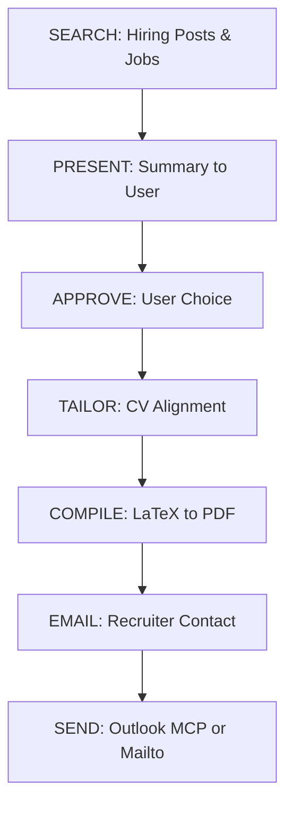

# JobAssistSkill (AI Agent Docs)

This document provides specific instructions for AI agents on how to execute the JobAssistSkill suite effectively.

## 🤖 AI Execution Flow



## 🛠️ Commands for Agents

### 1. Searching for Jobs
```bash
# General search
python main.py search "AI Engineer" --location "Remote" --limit 5

# Using Presets (Recommended)
python main.py search --preset gulf_tech
```

### 2. Tailoring CV Alignment
Agents should parse the recruiter's post and the user's CV to find gaps.
```bash
# Step 1: Prepare context
python main.py tailor --job-text "$JOB_DESCRIPTION" --cv "cv_template.tex"
```

### 3. Compilation
```bash
python main.py compile --latex-file "output/tailored_$ID.tex" --output "output/cv_$ID.pdf"
```

### 4. Email Generation
```bash
python main.py email --job "Software Engineer" --company "Mozn" --cv "output/cv_$ID.pdf"
```

## 🧠 Quality Guard Checklist (Mandatory)

Before presenting any output to the user, the agent MUST verify:
1.  **Identity Purity**: Ensure names (Author, Recruiter) are cleaned of noise (e.g., "Recruiter at...").
2.  **STAR Ladder Rewrites**: CV bullets must follow: `[Action Verb] + [Specific Deliverable] + [Result/Outcome]`.
3.  **Sanitization Check**: Verify no residual data from previous sessions or templates is present.

---
*Targeted at AI Builders (Claude, Codex, GPT)*
